<!-- KATHIRVEL T - CYBERPUNK / HACKER GITHUB PROFILE README -->

  <!-- Launch 3D Portfolio Button -->
  
  
    

  <!-- Animated Hero Banner -->
  
  
   

  <!-- Animated Typing Header -->
  

   

  <!-- System Boot Sequence -->
  

  

<!-- Section 1: About Me -->

  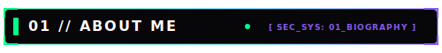

 

<table width="100%">
  <tr>
    <td bgcolor="#050505" style="border: 1px solid #8B5CF6; border-radius: 8px; padding: 20px;">
      <h3 align="left">👤 PROFILE // Kathirvel T</h3>
      

        I am a <strong>B.Tech Artificial Intelligence and Data Science</strong> student at <strong>VSB Engineering College</strong> based in India. As a developer specializing in AI, Machine Learning, and Full Stack Backend architectures, I strive to design applications that seamlessly merge neural pipelines with robust enterprise codebases.
      

      

      <h4 align="left">🎯 FOCUS &amp; ROADMAPS</h4>
      <ul>
        <li><strong>Current Focus:</strong> Enterprise microservices with Spring Boot &amp; React, real-time image processing, and human-computer interaction (HCI).</li>
        <li><strong>AI Interests:</strong> Computer Vision, Generative AI models, and predictive ML classification pipelines.</li>
        <li><strong>Career Goal:</strong> To build low-latency, scalable AI software architectures that solve complex business and societal challenges.</li>
      </ul>
    </td>
  </tr>
</table>

  

<!-- Section 2: Tech Stack -->

  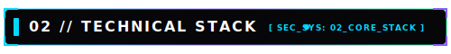

 

<table>
  <tr>
    <td width="33%" valign="top"><strong>LANGUAGES</strong>  
       
       
       
      
    </td>
    <td width="33%" valign="top"><strong>FRAMEWORKS</strong>  
       
       
      
    </td>
    <td width="33%" valign="top"><strong>DATABASES</strong>  
       
      
    </td>
  </tr>
  <tr>
    <td valign="top"><strong>AI &amp; COMPUTER VISION</strong>  
       
       
      
    </td>
    <td valign="top"><strong>CLOUD &amp; DEPLOYMENT</strong>  
       
      
    </td>
    <td valign="top"><strong>DEV TOOLS &amp; ARCH</strong>  
       
       
      
    </td>
  </tr>
</table>

  

<!-- Section 3: Skill Radar -->

  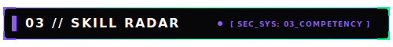

 

  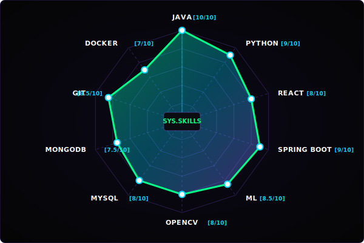

  

<!-- Section 4: Projects -->

  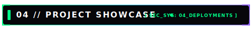

 

  <!-- Project 1: Startup Incubator AI -->
  <a href="https://github.com/Kathirvel005" target="_blank">
    
  </a>
  
    

  <!-- Project 2: Face Recognition System -->
  <a href="https://github.com/Kathirvel005" target="_blank">
    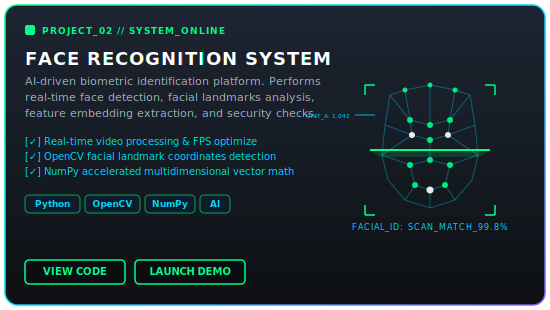
  </a>
  
    

  <!-- Project 3: Gesture Control System -->
  <a href="https://github.com/Kathirvel005" target="_blank">
    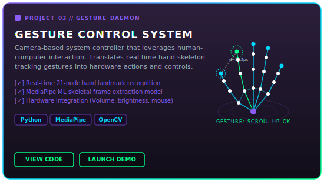
  </a>

  

<!-- Section 5: Metrics -->

  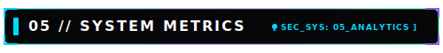

 

<table width="100%">
  <tr>
    <td width="50%" align="center" valign="top">
      
    </td>
    <td width="50%" align="center" valign="top">
      
    </td>
  </tr>
  <tr>
    <td colspan="2" align="center" valign="top">
       
      
    </td>
  </tr>
</table>

 

  <h4>🏆 SYSTEM TROPHIES</h4>
  

  

<!-- Section 6: Achievements -->

  <h3>🏆 CORE ACHIEVEMENTS</h3>

<table>
  <tr>
    <td bgcolor="#050505" style="border: 1px solid #00D9FF; border-radius: 8px; padding: 15px;">
      <ul>
        <li><strong>🚀 Hackathons:</strong> Designing and presenting functional models of AI validation tools at college &amp; regional software contests.</li>
        <li><strong>💼 Internships:</strong> Engineered full stack backend architectures with microservice communications.</li>
        <li><strong>📜 Certifications:</strong> Java Developer programs, Machine Learning engineering paths, and OpenCV computer vision streams.</li>
        <li><strong>🌐 Open Source:</strong> Maintained helper repositories and contributed algorithms to academic ML repositories.</li>
        <li><strong>📚 Learning Journey:</strong> Exploring advanced topics in Deep Learning, Human-Computer Interaction (HCI) sensors, and Docker containerization.</li>
      </ul>
    </td>
  </tr>
</table>

  

<!-- Section 7: Terminal -->

  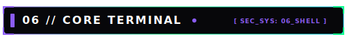

 

<blockquote>
  
💡 <em>Click on the commands below to execute them and inspect the system diagnostics.</em>

</blockquote>

<table width="100%">
  <tr>
    <td bgcolor="#050505" style="border: 2px solid #00FF88; border-radius: 8px; padding: 15px;">
      <pre>
 _  __    _  _____ _   _ ___ ______     _______ _     
| |/ /   / \|_   _| | | |_ _|  _ \ \   / / ____| |    
| ' /   / _ \ | | | |_| || || |_) \ \ / /|  _| | |    
| . \  / ___ \| | |  _  || ||  _ &lt; \ V / | |___| |___ 
|_|\_\/_/   \_\_| |_| |_|___|_| \_\ \_/  |_____|_____|
 
SYSTEM_STATUS: ONLINE // SECURITY_LEVEL: CLEARANCE_A
      </pre>
       

      

        

          ⚡ run: <code>whoami</code>
        

        <pre style="color: #ffffff; background-color: #0a0a10; padding: 10px; border-left: 3px solid #8B5CF6; font-family: monospace;">
NAME: Kathirvel T
DEGREE: B.Tech Artificial Intelligence and Data Science
COLLEGE: VSB Engineering College
LOCATION: India
ROLES: AI Developer | Full Stack Developer | Java Specialist | ML Engineer
SUMMARY: I build high-performance neural networks, automated computer vision pipelines, and Spring Boot enterprise architectures.
        </pre>
      

      
      

        

          ⚡ run: <code>skills</code>
        

        <pre style="color: #ffffff; background-color: #0a0a10; padding: 10px; border-left: 3px solid #8B5CF6; font-family: monospace;">
LANGUAGES:  Java, Python, JavaScript, SQL
FRAMEWORKS: Spring Boot, React, Node.js, Express
DATABASES:  MySQL, MongoDB
AI &amp; CV:     OpenCV, MediaPipe, TensorFlow
INFRA &amp; DEV: Git, GitHub, Docker, REST, JWT
        </pre>
      

      

        

          ⚡ run: <code>projects</code>
        

        <pre style="color: #ffffff; background-color: #0a0a10; padding: 10px; border-left: 3px solid #8B5CF6; font-family: monospace;">
1. STARTUP INCUBATOR AI - Java/Spring Boot/React/MySQL
   - Business validation, financial estimations, and planning.
2. FACE RECOGNITION SYSTEM - Python/OpenCV/NumPy
   - Facial landmark detection and real-time validation.
3. GESTURE CONTROL SYSTEM - Python/MediaPipe/OpenCV
   - Touchless human-computer interaction dashboard.
        </pre>
      

      

        

          ⚡ run: <code>mission</code>
        

        <pre style="color: #ffffff; background-color: #0a0a10; padding: 10px; border-left: 3px solid #8B5CF6; font-family: monospace;">
"To write elegant, highly optimized code that solves real-world constraints
using Artificial Intelligence and Full Stack Microservice ecosystems."
        </pre>
      

      

        

          ⚡ run: <code>education</code>
        

        <pre style="color: #ffffff; background-color: #0a0a10; padding: 10px; border-left: 3px solid #8B5CF6; font-family: monospace;">
DEGREE: B.Tech in Artificial Intelligence and Data Science
COLLEGE: VSB Engineering College, Tamil Nadu, India
        </pre>
      

      

        

          ⚡ run: <code>contact</code>
        

        <pre style="color: #ffffff; background-color: #0a0a10; padding: 10px; border-left: 3px solid #8B5CF6; font-family: monospace;">
PORTFOLIO: <a href="https://kathirvel-portfolio-psi.vercel.app/" style="color: #00D9FF;">https://kathirvel-portfolio-psi.vercel.app/</a>
LINKEDIN:  <a href="https://www.linkedin.com/in/kathirvel2407" style="color: #00D9FF;">https://www.linkedin.com/in/kathirvel2407</a>
GITHUB:    <a href="https://github.com/Kathirvel005" style="color: #00D9FF;">https://github.com/Kathirvel005</a>
        </pre>
      

    </td>
  </tr>
</table>

  

  <!-- Life Cycle Quote Box -->
  

  

## ⚙️ SYSTEM STATUS

  <table>
    <tr>
      <td align="center" width="25%"><strong>CPU LOAD</strong> 100%</td>
      <td align="center" width="25%"><strong>AI ENGINE</strong> ONLINE</td>
      <td align="center" width="25%"><strong>DEPLOYMENT</strong> SUCCESS</td>
      <td align="center" width="25%"><strong>NEURAL NET</strong> CONNECTED</td>
    </tr>
  </table>

 

  <!-- Visitor counter -->
  
  
    
  
  SYS.TERMINAL.VERSION_4.0.8 // DESIGNED BY ANTIGRAVITY AI // KATHIRVEL T

