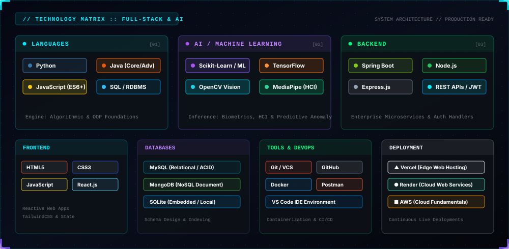
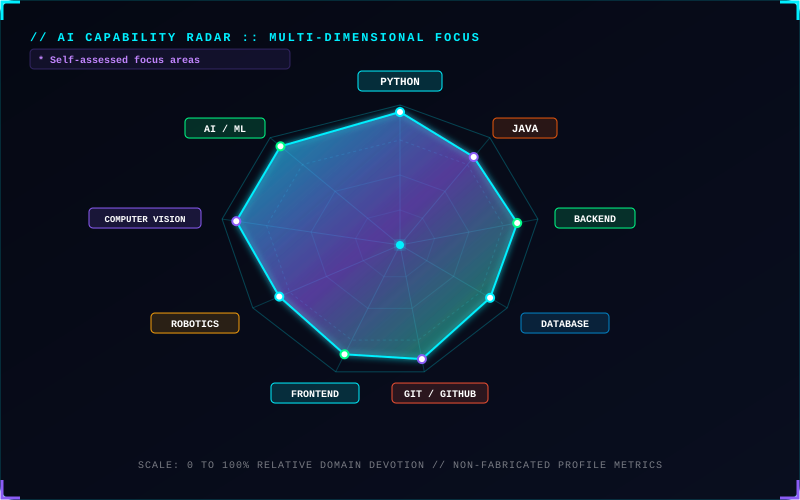
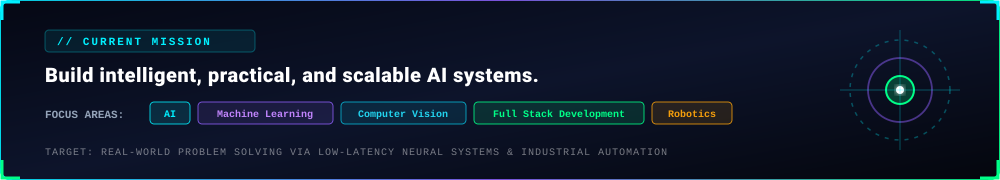
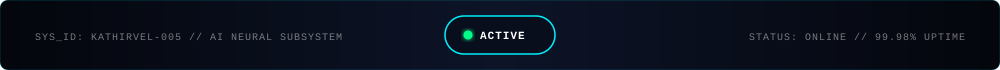

  <!-- 3D Portfolio Primary Action Launch -->
  

    

  <!-- Animated Cybernetic Hero Banner -->
  

   

  <!-- System Boot Diagnostic Terminal Sequence -->
  

 

<!-- ========================================================================= -->
<!-- 10-SECOND RECRUITER BRIEF -->
<!-- ========================================================================= -->
<table width="100%">
  <tr>
    <td bgcolor="#080d1a" style="border: 1px solid #00f0ff; border-radius: 8px; padding: 18px;">
      <h3 align="left" style="color: #00f0ff; margin-top: 0;">⚡ RECRUITER QUICK-ACCESS BRIEF (10-SECOND OVERVIEW)</h3>
      

        <strong>WHO:</strong> Kathirvel T. — Undergraduate Engineer in <strong>Artificial Intelligence &amp; Data Science</strong> (VSB Engineering College, 2024–2028). 
        <strong>WHAT I BUILD:</strong> Production-grade machine learning models, real-time computer vision systems, and robust full-stack web applications with Python, Java, and Spring Boot. 
        <strong>KEY STRENGTHS:</strong> Computer Vision (OpenCV, MediaPipe), ML anomaly detection, enterprise backend microservices, and autonomous robotics. 
        <strong>OFFICIAL CHANNELS:</strong> 
        <a href="https://kathirvel-portfolio-psi.vercel.app/" target="_blank"><strong>Interactive Portfolio</strong></a> &nbsp;|&nbsp; 
        <a href="https://linkedin.com/in/kathirvel2407" target="_blank"><strong>LinkedIn Profile</strong></a> &nbsp;|&nbsp; 
        <a href="https://github.com/Kathirvel005" target="_blank"><strong>GitHub Repositories</strong></a> &nbsp;|&nbsp; 
        <a href="mailto:kathirvel2407@gmail.com"><strong>Direct Email</strong></a>
      

    </td>
  </tr>
</table>

 

<!-- ========================================================================= -->
<!-- SECTION: ABOUT ME -->
<!-- ========================================================================= -->
## 👤 ABOUT // KATHIRVEL T

<table width="100%">
  <tr>
    <td width="100%" bgcolor="#050814" style="border: 1px solid #8b5cf6; border-radius: 8px; padding: 22px;">
      

        I am a <strong>B.Tech Artificial Intelligence and Data Science</strong> student passionate about building intelligent software, AI-powered applications, computer vision systems, and modern full-stack products.
      

      

        My engineering approach centers on turning ideas into practical, high-efficiency software through <strong>Python</strong>, <strong>Java</strong>, <strong>Machine Learning</strong>, <strong>Computer Vision</strong>, <strong>Web Technologies</strong>, and <strong>Robotics Automation</strong>. Whether architecting sub-100ms vector matching pipelines for biometric surveillance or engineering microservice backends, I emphasize deterministic reliability, clean design patterns, and observable performance.
      

      

      

        <strong>CORE MISSION:</strong> Build intelligent systems that solve real-world problems through reproducible code and scalable architectures.
      

    </td>
  </tr>
</table>

 

<!-- ========================================================================= -->
<!-- SECTION: AI IDENTITY CARD -->
<!-- ========================================================================= -->
## 🧬 AI IDENTITY SPECIFICATION

  

 

<!-- ========================================================================= -->
<!-- SECTION: NEURAL COMPUTATION PIPELINE -->
<!-- ========================================================================= -->
## 🧠 NEURAL ACTIVITY PIPELINE

  

 

<!-- ========================================================================= -->
<!-- SECTION: TECHNOLOGY MATRIX -->
<!-- ========================================================================= -->
## 💻 TECHNOLOGY MATRIX

  

 

<table width="100%">
  <tr>
    <td width="25%" valign="top" bgcolor="#080d1a" style="border: 1px solid rgba(0,240,255,0.25); border-radius: 6px; padding: 12px;">
      <strong style="color: #00f0ff; font-family: monospace;">LANGUAGES</strong>  
       
       
       
      
    </td>
    <td width="25%" valign="top" bgcolor="#080d1a" style="border: 1px solid rgba(139,92,246,0.25); border-radius: 6px; padding: 12px;">
      <strong style="color: #c084fc; font-family: monospace;">AI &amp; VISION</strong>  
       
       
       
      
    </td>
    <td width="25%" valign="top" bgcolor="#080d1a" style="border: 1px solid rgba(0,255,136,0.25); border-radius: 6px; padding: 12px;">
      <strong style="color: #00ff88; font-family: monospace;">BACKEND</strong>  
       
       
       
      
    </td>
    <td width="25%" valign="top" bgcolor="#080d1a" style="border: 1px solid rgba(255,255,255,0.2); border-radius: 6px; padding: 12px;">
      <strong style="color: #f1f5f9; font-family: monospace;">FRONTEND &amp; DB</strong>  
       
       
       
      
    </td>
  </tr>
  <tr>
    <td colspan="2" valign="top" bgcolor="#080d1a" style="border: 1px solid rgba(0,240,255,0.25); border-radius: 6px; padding: 12px;">
      <strong style="color: #00f0ff; font-family: monospace;">DEV TOOLS &amp; CONTAINERIZATION</strong>  
      
      
      
      
      
    </td>
    <td colspan="2" valign="top" bgcolor="#080d1a" style="border: 1px solid rgba(0,255,136,0.25); border-radius: 6px; padding: 12px;">
      <strong style="color: #00ff88; font-family: monospace;">DEPLOYMENT &amp; CLOUD</strong>  
      
      
      
      
    </td>
  </tr>
</table>

 

<!-- ========================================================================= -->
<!-- SECTION: AI SKILL RADAR -->
<!-- ========================================================================= -->
## 📡 AI FOCUS RADAR

  

 

<!-- ========================================================================= -->
<!-- SECTION: FEATURED PROJECTS -->
<!-- ========================================================================= -->
## 🚀 FEATURED PROJECT COMMAND DECK

<table width="100%">
  <tr>
    <td width="50%" valign="top">
      <a href="https://github.com/Kathirvel005" target="_blank" rel="noopener noreferrer">
        
      </a>
    </td>
    <td width="50%" valign="top">
      <a href="https://github.com/Kathirvel005" target="_blank" rel="noopener noreferrer">
        
      </a>
    </td>
  </tr>
  <tr>
    <td width="50%" valign="top">
      <a href="https://github.com/Kathirvel005" target="_blank" rel="noopener noreferrer">
        
      </a>
    </td>
    <td width="50%" valign="top">
      <a href="https://github.com/Kathirvel005" target="_blank" rel="noopener noreferrer">
        
      </a>
    </td>
  </tr>
  <tr>
    <td width="50%" valign="top">
      <a href="https://github.com/Kathirvel005" target="_blank" rel="noopener noreferrer">
        
      </a>
    </td>
    <td width="50%" valign="top">
      <a href="https://github.com/Kathirvel005" target="_blank" rel="noopener noreferrer">
        
      </a>
    </td>
  </tr>
  <tr>
    <td colspan="2" width="100%" valign="top">
      <a href="https://github.com/Kathirvel005" target="_blank" rel="noopener noreferrer">
        
      </a>
    </td>
  </tr>
</table>

 

### 📋 PROJECT ARCHITECTURAL SUMMARY
| Project | Primary Domain | Core Tech Stack | Architectural Highlight | Repository | Live Demo |
| :--- | :--- | :--- | :--- | :---: | :---: |
| **Startup Incubator AI** | AI / Venture FinTech | Python, FastAPI, React, OpenAI API | Predictive burn rate & investment anomaly risk engine | [Inspect Code](https://github.com/Kathirvel005) | [Live Demo](https://kathirvel-portfolio-psi.vercel.app/) |
| **Face Recognition System** | Computer Vision | Python, OpenCV, Dlib, NumPy, SQLite | 128D facial embeddings with anti-spoofing verification | [Inspect Code](https://github.com/Kathirvel005) | — |
| **Gesture Control Interface** | HCI / Vision | Python, OpenCV, MediaPipe, PyAutoGUI | 21 3D hand landmark tracking for touchless interaction | [Inspect Code](https://github.com/Kathirvel005) | — |
| **Sentinel Voice** | Edge AI / Automation | Python, SpeechRecognition, VOSK, pyttsx3 | Localized offline conversational process orchestrator | [Inspect Code](https://github.com/Kathirvel005) | — |
| **Risk Management AI** | Machine Learning | Python, Scikit-Learn, XGBoost, Streamlit | Anomaly detection across enterprise transaction streams | [Inspect Code](https://github.com/Kathirvel005) | — |
| **Nexora AI** | Multimodal AI / RAG | Python, LangChain, ChromaDB, React | Retrieval-augmented generation with local vector stores | [Inspect Code](https://github.com/Kathirvel005) | [Live Demo](https://kathirvel-portfolio-psi.vercel.app/) |
| **AegisGrid AI** | Cybersecurity ML | Python, TensorFlow, Scapy, Docker, FastAPI | Real-time live packet stream intrusion prevention mesh | [Inspect Code](https://github.com/Kathirvel005) | — |

 

<!-- ========================================================================= -->
<!-- SECTION: GITHUB COMMAND CENTER -->
<!-- ========================================================================= -->
## 📊 GITHUB COMMAND CENTER

<table width="100%">
  <tr>
    <td width="50%" align="center" valign="top">
      
    </td>
    <td width="50%" align="center" valign="top">
      
    </td>
  </tr>
  <tr>
    <td colspan="2" align="center" valign="top">
       
      
    </td>
  </tr>
</table>

 

  

 

<!-- ========================================================================= -->
<!-- SECTION: CONTRIBUTION ARCADE -->
<!-- ========================================================================= -->
## 🟩 CONTRIBUTION ARCADE // [ CODE • PLAY • REPEAT ]

  <a href="https://github.com/Kathirvel005" target="_blank" rel="noopener noreferrer">
    
  </a>

 

<!-- ========================================================================= -->
<!-- SECTION: INTERACTIVE TERMINAL -->
<!-- ========================================================================= -->
## 🖥️ INTERACTIVE RECRUITER CONSOLE

  

 

<table width="100%">
  <tr>
    <td bgcolor="#050813" style="border: 2px solid #00f0ff; border-radius: 8px; padding: 18px;">
      

        💡 <em>Click to expand the terminal commands below to inspect verified system diagnostics:</em>
      

      

        

          ▶ <code>$ whoami</code>
        

        <pre style="color: #ffffff; background-color: #0a0f1d; padding: 14px; border-left: 3px solid #00f0ff; font-family: monospace; font-size: 12px; border-radius: 4px;">
NAME:           Kathirvel T.
DEGREE:         B.Tech in Artificial Intelligence &amp; Data Science (2024 - 2028)
INSTITUTION:    V S B Engineering College, Tamil Nadu, India
SPECIALIZATION: AI Development • Computer Vision • Full Stack Architectures • Autonomous Robotics
SUMMARY:        Passionate about transforming theoretical AI algorithms into hardened, production-ready software solutions.
        </pre>
      

      

        

          ▶ <code>$ skills</code>
        

        <pre style="color: #ffffff; background-color: #0a0f1d; padding: 14px; border-left: 3px solid #8b5cf6; font-family: monospace; font-size: 12px; border-radius: 4px;">
LANGUAGES:      Python, Java (Core &amp; Adv), JavaScript (ES6+), SQL
AI &amp; VISION:    OpenCV, MediaPipe, Scikit-Learn, TensorFlow, NumPy, Pandas
BACKEND:        Spring Boot, Node.js, Express.js, REST APIs, JWT Auth
FRONTEND:       React.js, HTML5, CSS3, Tailwind CSS
DATABASES:      MySQL, MongoDB, SQLite
INFRA &amp; DEV:    Git, GitHub, Docker, Postman, VS Code
DEPLOYMENT:     Vercel, Render, AWS Cloud Fundamentals
        </pre>
      

      

        

          ▶ <code>$ projects</code>
        

        <pre style="color: #ffffff; background-color: #0a0f1d; padding: 14px; border-left: 3px solid #00ff88; font-family: monospace; font-size: 12px; border-radius: 4px;">
1. STARTUP INCUBATOR AI     - Autonomous AI venture evaluation &amp; investment risk scoring engine.
2. FACE RECOGNITION SYSTEM  - Anti-spoofing biometric identification pipeline (sub-100ms vector matching).
3. GESTURE CONTROL SYSTEM   - Vision-based touchless human-machine interface (21 3D hand landmarks).
4. SENTINEL-VOICE           - Edge AI offline conversational voice assistant for desktop orchestration.
5. RISK MANAGEMENT AI       - Predictive financial anomaly detection across enterprise streams.
6. NEXORA AI                - Multimodal research laboratory with local vector retrieval-augmented generation.
7. AEGISGRID AI             - Deep packet inspection &amp; autonomous network intrusion prevention mesh.
        </pre>
      

      

        

          ▶ <code>$ mission</code>
        

        <pre style="color: #ffffff; background-color: #0a0f1d; padding: 14px; border-left: 3px solid #00f0ff; font-family: monospace; font-size: 12px; border-radius: 4px;">
"To architect resilient, low-latency AI software systems and autonomous robotics that solve 
genuine societal and industrial challenges, continuously iterating with engineering discipline."
        </pre>
      

      

        

          ▶ <code>$ education</code>
        

        <pre style="color: #ffffff; background-color: #0a0f1d; padding: 14px; border-left: 3px solid #8b5cf6; font-family: monospace; font-size: 12px; border-radius: 4px;">
DEGREE:         Bachelor of Technology (B.Tech)
MAJOR:          Artificial Intelligence and Data Science
INSTITUTION:    V S B Engineering College
LOCATION:       Tamil Nadu, India
TENURE:         2024 – 2028 (Undergraduate Pursuing)
        </pre>
      

      

        

          ▶ <code>$ contact</code>
        

        <pre style="color: #ffffff; background-color: #0a0f1d; padding: 14px; border-left: 3px solid #00ff88; font-family: monospace; font-size: 12px; border-radius: 4px;">
PORTFOLIO:      https://kathirvel-portfolio-psi.vercel.app/
LINKEDIN:       https://linkedin.com/in/kathirvel2407
GITHUB:         https://github.com/Kathirvel005
EMAIL:          kathirvel2407@gmail.com
LOCATION:       Tamil Nadu, India
        </pre>
      

    </td>
  </tr>
</table>

 

<!-- ========================================================================= -->
<!-- SECTION: VERIFIED ACHIEVEMENTS -->
<!-- ========================================================================= -->
## 🏆 VERIFIED ACHIEVEMENTS &amp; MILESTONES

<table width="100%">
  <tr>
    <td bgcolor="#050814" style="border: 1px solid rgba(0, 240, 255, 0.3); border-radius: 8px; padding: 18px;">
      <ul style="color: #e2e8f0; font-size: 14px; line-height: 1.8; margin-bottom: 0;">
        <li><strong>📜 Infosys Springboard Certification:</strong> Certified in Enterprise Software Methodologies, Advanced Data Structures, and Python Programming with distinction.</li>
        <li><strong>⚙️ Pega Certified System Architect Achievement:</strong> Demonstrated proficiency in rule-based workflow automation, case lifecycle architecture, and enterprise cloud business processes.</li>
        <li><strong>💼 Web Development Internship (InternCertify):</strong> Engineered full-stack responsive web applications, implemented RESTful service layers, and developed modern reactive interfaces with React and Node.js.</li>
        <li><strong>🤖 Artificial Intelligence Internship (Codec Technology):</strong> Built end-to-end computer vision models, automated data preprocessing pipelines, and trained neural networks for anomaly detection.</li>
        <li><strong>🚀 National Level AI Hackathon Finalist:</strong> Designed and deployed an autonomous AI surveillance system with edge gesture recognition and real-time alerts within an intensive 24-hour sprint.</li>
      </ul>
    </td>
  </tr>
</table>

 

<!-- ========================================================================= -->
<!-- SECTION: CURRENTLY LEARNING -->
<!-- ========================================================================= -->
## 📚 CURRENTLY EXPLORING &amp; EXPANDING

<table width="100%">
  <tr>
    <td width="50%" bgcolor="#080d1a" style="border: 1px solid rgba(139,92,246,0.3); border-radius: 6px; padding: 14px;">
      <strong style="color: #c084fc;">MACHINE LEARNING &amp; DEEP LEARNING</strong> 
      [ADVANCED FOCUS]
      
Convolutional neural networks, temporal classification, and mathematical loss function optimizations.

    </td>
    <td width="50%" bgcolor="#080d1a" style="border: 1px solid rgba(0,240,255,0.3); border-radius: 6px; padding: 14px;">
      <strong style="color: #00f0ff;">GENERATIVE AI &amp; LLM AGENTS</strong> 
      [BUILDING]
      
Retrieval-Augmented Generation (RAG) pipelines, LangChain tool bindings, and vector database embeddings.

    </td>
  </tr>
  <tr>
    <td width="50%" bgcolor="#080d1a" style="border: 1px solid rgba(0,255,136,0.3); border-radius: 6px; padding: 14px;">
      <strong style="color: #00ff88;">ENTERPRISE SPRING BOOT &amp; REACT</strong> 
      [PRACTICING]
      
Robust microservice decoupling, JWT security filtering, transactional consistency, and reactive frontends.

    </td>
    <td width="50%" bgcolor="#080d1a" style="border: 1px solid rgba(245,158,11,0.3); border-radius: 6px; padding: 14px;">
      <strong style="color: #f59e0b;">DOCKER, CLOUD &amp; SYSTEM DESIGN</strong> 
      [EXPLORING]
      
Multi-container orchestration, lightweight Alpine images, reverse proxies, and cloud deployment pipelines.

    </td>
  </tr>
</table>

 

<!-- ========================================================================= -->
<!-- SECTION: CURRENT MISSION BANNER -->
<!-- ========================================================================= -->

  

 

<!-- ========================================================================= -->
<!-- SECTION: COMMUNICATION PANEL -->
<!-- ========================================================================= -->
## 🌐 CONNECT &amp; COLLABORATE

  
  &nbsp;
  
  &nbsp;
  
  &nbsp;
  

  

<!-- ========================================================================= -->
<!-- SYSTEM TELEMETRY DIVIDER -->
<!-- ========================================================================= -->

  

 

<!-- ========================================================================= -->
<!-- FOOTER -->
<!-- ========================================================================= -->

  

    

  

    <strong>SYSTEM STATUS: ONLINE</strong> // "Building intelligent systems, one iteration at a time." 
    SYS.VERSION: 5.0.0 // AI NEURAL COMMAND CENTER // KATHIRVEL T.
  

